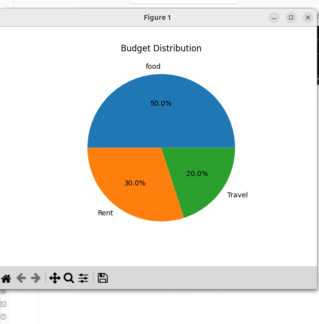
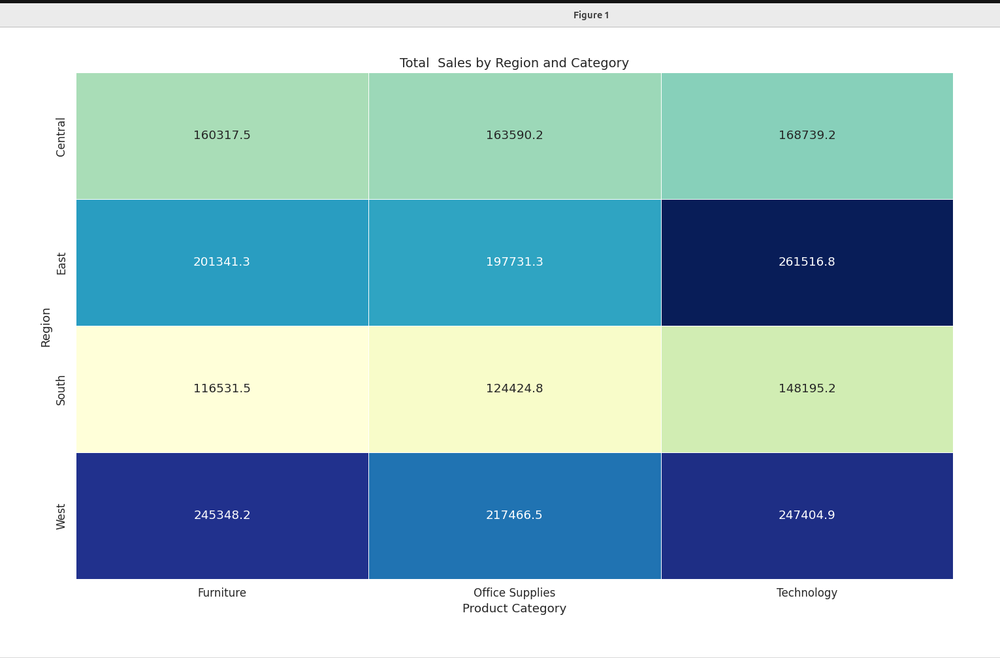

📊 Data Visualization with Matplotlib

A beginner-friendly Python project demonstrating how to create different types of charts using Matplotlib.

This project covers:

📈 Line Graph
variable_x=[1,3,5,8,9,12,34]
variable_y=[x*3 for x in variable_x]

plt.plot(variable_x,variable_y)
plt.title("Temperature over hours")
plt.xlabel("Hour")
plt.ylabel("Temperature")
plt.show()

📊 Bar Chart

📊 Horizontal Bar Chart

🥧 Pie Chart

🔴 Scatter Plot

🚀 Tech Stack

Python 3

Matplotlib

Pandas

Install dependencies:

pipenv install matplotlib pandas
pipenv shell

#Below in seaborn

